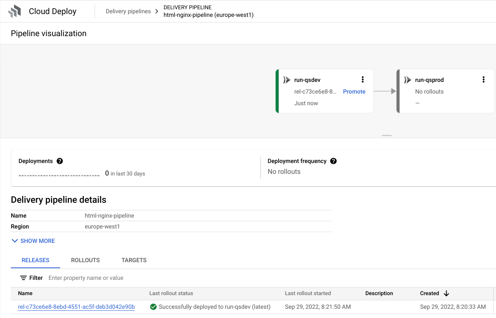

# Cloud Run with Cloud Deploy
Simple Cloud Run deployment pipeline using Terraform, CloudBuild, CloudDeploy, Artifact Registry and Cloud Run to deploy a simple web site from a docker container in GCP.

Source for the Skaffold configuration: [https://cloud.google.com/deploy/docs/deploy-app-run](https://cloud.google.com/deploy/docs/deploy-app-run)


## Overall architecture


## Project structure
```

.
├── app (web application based on nginx)
│   ├── Dockerfile
│   └── index.html
├── cloudbuild.yaml (build sequence for Cloud Build)
├── clouddeploy.yaml (delivery pipeline for Cloud Deploy )
├── config.tf (services and provider)
├── deploy.sh (deploy script using gcloud command)
├── gcr.tf (managed artifact repository)
├── iam.tf (service accounts and roles)
├── install.sh (install script for gcp api using gcloud command)
├── README.md
├── run-dev.yaml (cloud run service dev)
├── run-prod.yaml (cloud run service prod)
├── skaffold.yaml (scaffold file for Cloud Deploy)
├── terraform.tfvars.json (local env variables for terraform)
├── uninstall.sh (uninstall script using gcloud command)
└── vars.tf (variables configuration)

```

## Setup

1. Find out your GCP project's id and number from the dashboard in the cloud console, and run the following commands in a terminal at the root of source code (replace `your_project_number`, `your_project_id` and `your_project_region` by the correct values):
```shell
find . -type f -not -path '*/\.*' -exec sed -i 's/PROJECT_NMR/your_project_number/g' {} +
find . -type f -not -path '*/\.*' -exec sed -i 's/PROJECT_ID/your_project_id/g' {} +
find . -type f -not -path '*/\.*' -exec sed -i 's/PROJECT_REGION/your_project_region/g' {} +
```

## Install

1. Run the following command at the root of the folder:
```shell 
$ ./install.sh
$ terraform init
$ terraform plan
$ terraform apply
```

> Note: You may have to run `terraform plan` and `terraform apply` twice if you get errors for serviceaccounts not found

2. Build and deploy the webserver image in GKE, by issuing the following command at the root of the project:

```shell
$ ./deploy.sh
```

> This will build a docker image using Cloud Build, and create a release in Cloud Deploy




> This will then deploy the dev image to Cloud Run using Cloud Deploy


> Selecting the deployed Cloud Run service, it gives access to the exposed URL


> Opening this in a browser, shows a 403 error


3. Run the following command at the root of the project

```shell 
gcloud run services add-iam-policy-binding deploy-qs-dev --member="allUsers" --role="roles/run.invoker" --project="<your_project_id>" --region="<your_project_region>"
```

> This now allows unauthenticated access to the service


> Opening the same URL in a browser, it should show the following:


4. Back in Cloud Deploy, click on "promote" for the dev release


> Click again on "promote" at the bottom of the side panel:


> After a short while, it Cloud Deploy deploys a release in production


> This, as a result, has deployed the same docker image as a production Cloud Run service


3. Run the following command at the root of the project

```shell 
gcloud run services add-iam-policy-binding deploy-qs-prod --member="allUsers" --role="roles/run.invoker" --project="<your_project_id>" --region="<your_project_region>"
```

> This now allows unauthenticated access to the prod service


> Opening the production service URL in a browser, it should show the following:


## Uninstall


1. Run the following at the root of your project

```shell 
$ ./uninstall.sh
```

> All resources will now be removed from your project
